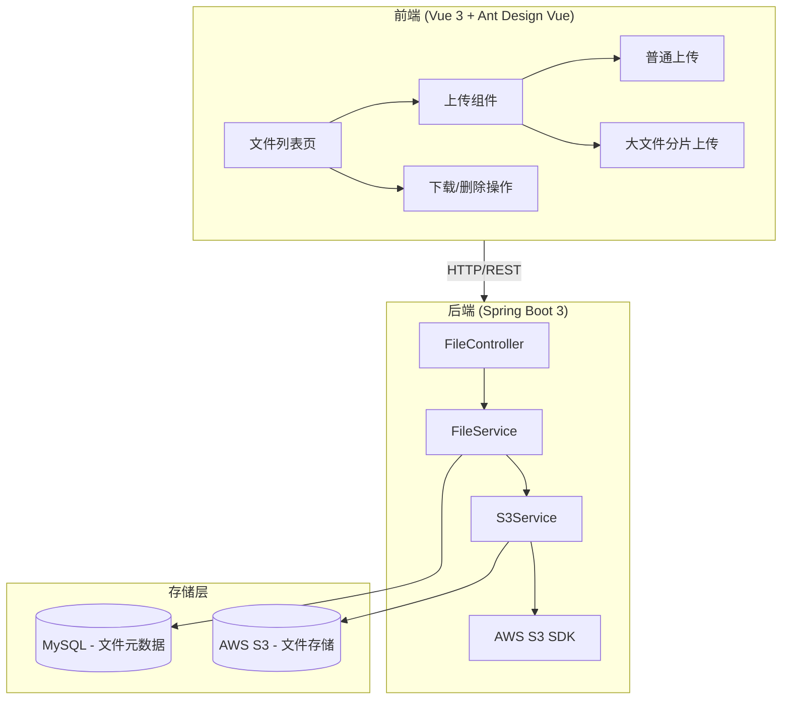
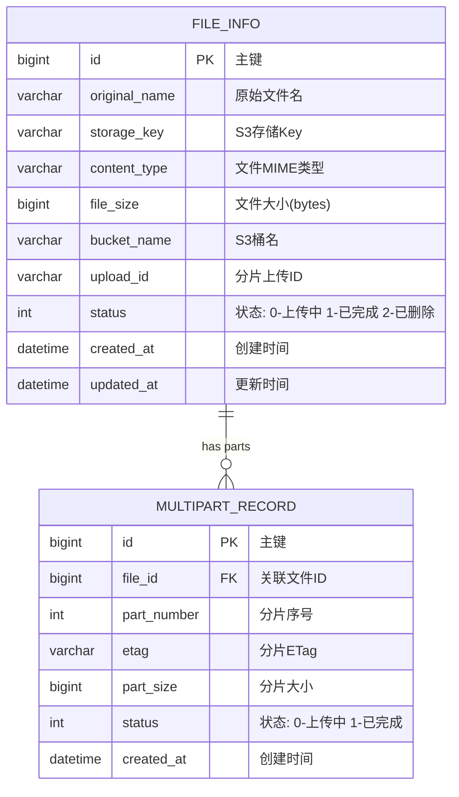

# AWS S3 文件管理系统 - 项目设计文档

## 1. 系统架构

## 2. ER 图

## 3. 接口清单

### FileController (`/api/files`)

| Method | Path | 说明 |
|--------|------|------|
| POST | `/api/files/upload` | 普通文件上传 |
| GET | `/api/files` | 文件列表查询(分页) |
| GET | `/api/files/download/{id}` | 文件下载 |
| DELETE | `/api/files/{id}` | 文件删除 |
| POST | `/api/files/multipart/init` | 初始化分片上传 |
| GET | `/api/files/multipart/presign` | 获取分片预签名URL |
| POST | `/api/files/multipart/complete` | 完成分片上传 |
| POST | `/api/files/multipart/abort` | 取消分片上传 |

## 4. UI/UX 规范

- 主色调: `#1890ff` (Ant Design 蓝)
- 背景色: `#f0f2f5`
- 卡片圆角: `8px`
- 卡片阴影: `0 2px 8px rgba(0,0,0,0.09)`
- 间距体系: `8px / 16px / 24px`
- 字体: `-apple-system, BlinkMacSystemFont, 'Segoe UI', Roboto`
- 标题字号: `20px` / 正文: `14px` / 辅助: `12px`
